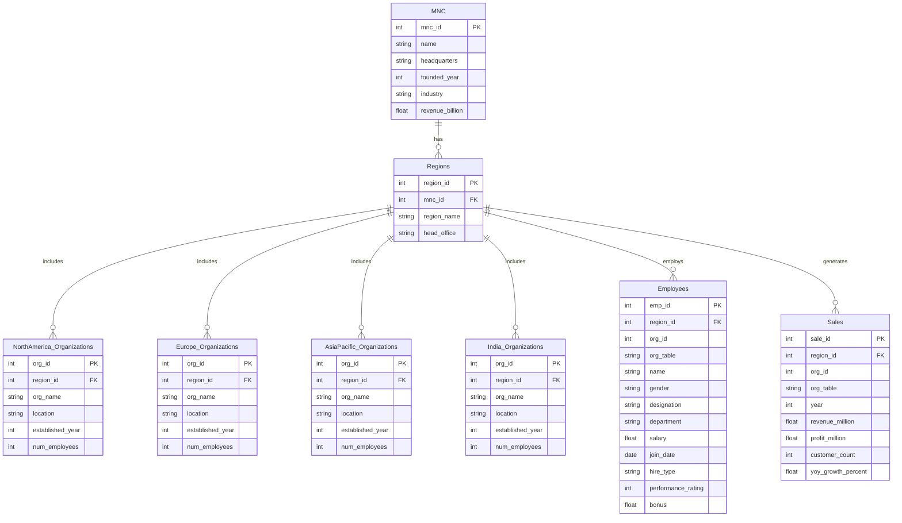

# 📊 SQL Buddy

SQL Buddy is a **Streamlit-based interactive tool** designed to simplify SQL practice and learning.  
With a clean interface and built-in SQL execution environment, it helps learners and professionals practice queries in real-time.


---

## ✨ Features
- 🖥️ Interactive SQL query execution  
- 📂 Support for sample databases  
- 📊 Query results displayed in a neat, tabular format  
- ⚡ Fast and lightweight UI powered by **Streamlit**  
- 📱 Works directly in the browser – no installation required  

---

## 🛠️ Tech Stack
- **Frontend & UI**: Streamlit  
- **Backend**: SQLite (or custom DB as configured)  
- **Language**: Python  

---

## 📂 Project Structure
~~~
SQL-BUDDY/
│── README.md
│── app.py
│── requirements.txt
│── MNC.db
│── assets/
│   ├── screenshot1.png
│   ├── screenshot2.png
│   └── screenshot3.png
│   ├── screenshot4.png

~~~
## 🗄️ Database Schema (MNC.db)


## 📦 Installation (Run Locally)

1. **Clone the repo**
   ```
   git clone https://github.com/<your-username>/SQL-BUDDY.git
   cd SQL-BUDDY
   
2. **Create a virtual environment (recommended)**
~~~
python -m venv venv
source venv/bin/activate   # On Mac/Linux
venv\Scripts\activate      # On Windows
pip install -r requirements.txt
Run the Streamlit app
~~~

streamlit run app.py

## 🧠 Tech Stack

| Component  | Technology        |
| ---------- | ----------------- |
| Frontend   | Streamlit         |
| Backend AI | Google Gemini API |
| Database   | SQLite            |
| Language   | Python            |

## Screenshots
### 🔹 English Commands
.png)

### 🔹 Tamil Commands
.png) 

### 🔹 Urdu Commands
.png)


## 🚀 Live Demo
👉 [Try SQL Buddy here](https://sql-buddy-08.streamlit.app/)


📜 License
This project is licensed under the MIT License – free to use and modify with attribution.

👨‍💻 Author
Developed with ❤️ by Syed Mustafa
## 🔗 Links
[](https://www.linkedin.com/in/syedmustafa29)
